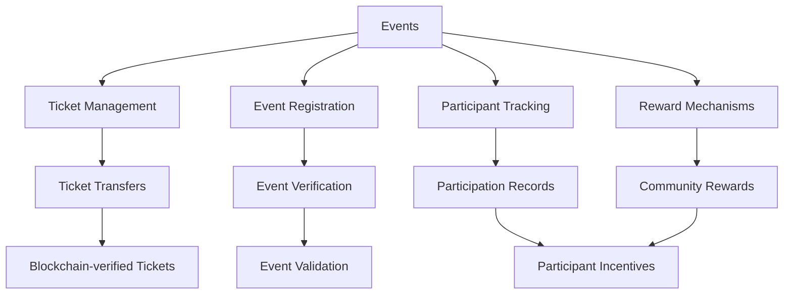

# Bitcoin Event Platform

A blockchain-based decentralized platform for managing and tracking Bitcoin-related events, with secure ticket registration, verification, and community engagement.

## Overview

The Bitcoin Event Platform creates a decentralized ecosystem for event management with the following key features:

- Secure event registration and ticket tracking
- Dynamic event participation management
- Ticket transfer and verification mechanisms
- Community event interaction
- Transparent event record-keeping

The platform enables event organizers and participants to manage Bitcoin-related events with full blockchain transparency and security.

## Architecture

The system is built around a central smart contract that manages:



Core components:
- Event creation and management
- Ticket registration and tracking
- Secure ticket transfer mechanisms
- Participation and reward systems
- Transparent event records

## Contract Documentation

### bitcoin-event.clar

The main contract managing all event platform functionality.

#### Key Features:

1. **Event Management**
    - Event registration and tracking
    - Ticket issuance and verification
    - Dynamic event participation

2. **Ticket Handling**
    - Secure ticket transfers
    - Ticket validity checks
    - Transfer restrictions

3. **Community Features**
    - Event participation rewards
    - Community interaction tracking
    - Transparent event records

## Getting Started

### Prerequisites
- Clarinet
- Stacks wallet

### Installation

1. Clone the repository
2. Install dependencies:
```bash
clarinet install
```

3. Test the contract:
```bash
clarinet test
```

### Basic Usage

1. Create an event:
```clarity
(contract-call? .bitcoin-event create-event "Bitcoin Conference" "Crypto Summit" u1000)
```

2. Register for an event:
```clarity
(contract-call? .bitcoin-event register-event-ticket u1 tx-sender)
```

3. Transfer a ticket:
```clarity
(contract-call? .bitcoin-event transfer-event-ticket u1 tx-sender RECIPIENT)
```

## Function Reference

### Event Management

```clarity
(create-event (name (string-utf8 100)) (description (string-utf8 256)) (ticket-price uint))
(update-event (event-id uint) (details (optional (string-utf8 256))))
(cancel-event (event-id uint))
```

### Ticket Handling

```clarity
(register-event-ticket (event-id uint) (participant principal))
(transfer-event-ticket (event-id uint) (sender principal) (recipient principal))
(verify-ticket (event-id uint) (ticket-id uint))
```

### Community Features

```clarity
(claim-event-participation-reward (event-id uint))
(leave-event-feedback (event-id uint) (rating uint) (comment (optional (string-utf8 256))))
```

## Development

### Testing

Run the test suite:
```bash
clarinet test
```

### Local Development

1. Start Clarinet console:
```bash
clarinet console
```

2. Deploy contract:
```bash
clarinet deploy
```

## Security Considerations

1. **Event Integrity**
    - Blockchain-verified event records
    - Immutable event creation and tracking
    - Transparent ticket management

2. **Ticket Security**
    - Non-transferable tickets with restrictions
    - Verifiable ticket ownership
    - Prevent ticket fraud

3. **Limitations**
    - Physical event verification remains external
    - Ticket transfer logic is contract-defined
    - Rewards are predefined by event parameters# Bitcoin Event Platform

A blockchain-based decentralized platform for managing and tracking Bitcoin-related events, with secure ticket registration, verification, and community engagement.

## Overview

The Bitcoin Event Platform creates a decentralized ecosystem for event management with the following key features:

- Secure event registration and ticket tracking
- Dynamic event participation management
- Ticket transfer and verification mechanisms
- Community event interaction
- Transparent event record-keeping

The platform enables event organizers and participants to manage Bitcoin-related events with full blockchain transparency and security.

## Architecture

The system is built around a central smart contract that manages:


Core components:
- Event creation and management
- Ticket registration and tracking
- Secure ticket transfer mechanisms
- Participation and reward systems
- Transparent event records

## Contract Documentation

### bitcoin-event.clar

The main contract managing all event platform functionality.

#### Key Features:

1. **Event Management**
    - Event registration and tracking
    - Ticket issuance and verification
    - Dynamic event participation

2. **Ticket Handling**
    - Secure ticket transfers
    - Ticket validity checks
    - Transfer restrictions

3. **Community Features**
    - Event participation rewards
    - Community interaction tracking
    - Transparent event records

## Getting Started

### Prerequisites
- Clarinet
- Stacks wallet

### Installation

1. Clone the repository
2. Install dependencies:
```bash
clarinet install
```

3. Test the contract:
```bash
clarinet test
```

### Basic Usage

1. Create an event:
```clarity
(contract-call? .bitcoin-event create-event "Bitcoin Conference" "Crypto Summit" u1000)
```

2. Register for an event:
```clarity
(contract-call? .bitcoin-event register-event-ticket u1 tx-sender)
```

3. Transfer a ticket:
```clarity
(contract-call? .bitcoin-event transfer-event-ticket u1 tx-sender RECIPIENT)
```

## Function Reference

### Event Management

```clarity
(create-event (name (string-utf8 100)) (description (string-utf8 256)) (ticket-price uint))
(update-event (event-id uint) (details (optional (string-utf8 256))))
(cancel-event (event-id uint))
```

### Ticket Handling

```clarity
(register-event-ticket (event-id uint) (participant principal))
(transfer-event-ticket (event-id uint) (sender principal) (recipient principal))
(verify-ticket (event-id uint) (ticket-id uint))
```

### Community Features

```clarity
(claim-event-participation-reward (event-id uint))
(leave-event-feedback (event-id uint) (rating uint) (comment (optional (string-utf8 256))))
```

## Development

### Testing

Run the test suite:
```bash
clarinet test
```

### Local Development

1. Start Clarinet console:
```bash
clarinet console
```

2. Deploy contract:
```bash
clarinet deploy
```

## Security Considerations

1. **Event Integrity**
    - Blockchain-verified event records
    - Immutable event creation and tracking
    - Transparent ticket management

2. **Ticket Security**
    - Non-transferable tickets with restrictions
    - Verifiable ticket ownership
    - Prevent ticket fraud

3. **Limitations**
    - Physical event verification remains external
    - Ticket transfer logic is contract-defined
    - Rewards are predefined by event parameters